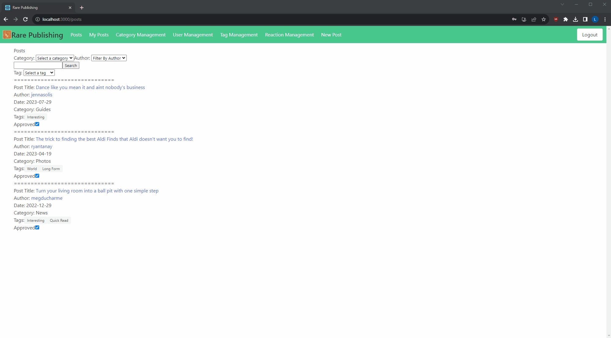
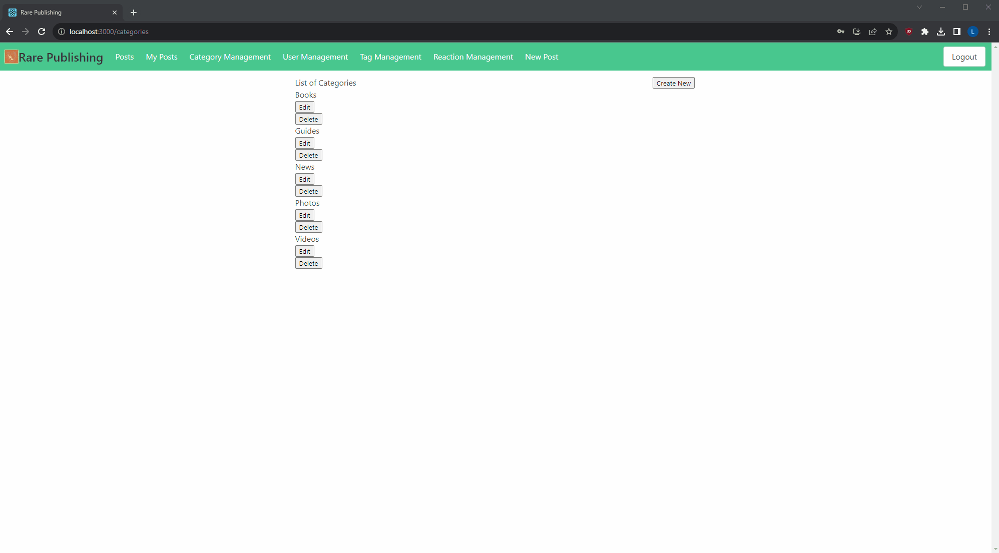
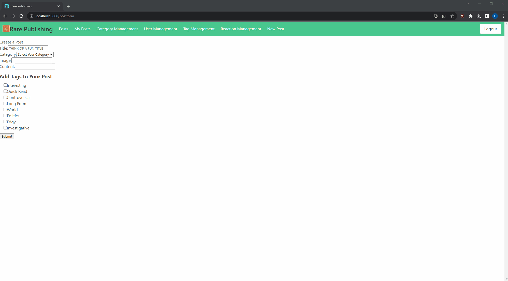

# Rare: The Publishing Platform for the Discerning Writer

## Getting Started
1. Install dependencies: `npm install`
2. Run the code `npm start`
<!-- TODO: Update the remaining steps if anything changes -->
3. With the server also running, check that the login, register, and logout functionality is in working.
4. This template is using [Bulma](https://bulma.io/documentation) for styling. Take a little bit of time to familiarize yourself with the framework if you would like to continue using it.

<!-- TODO: Finish writing the readme -->

